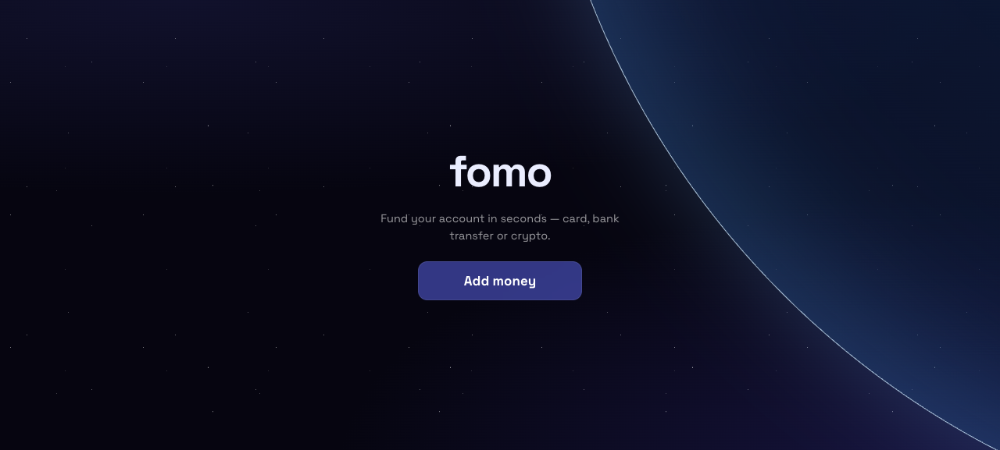
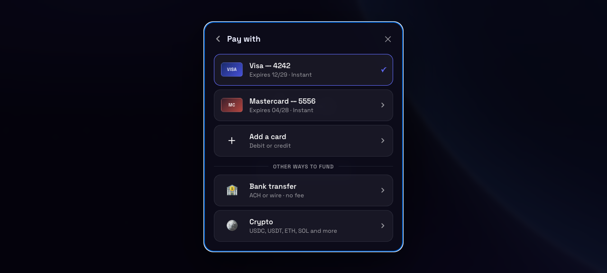
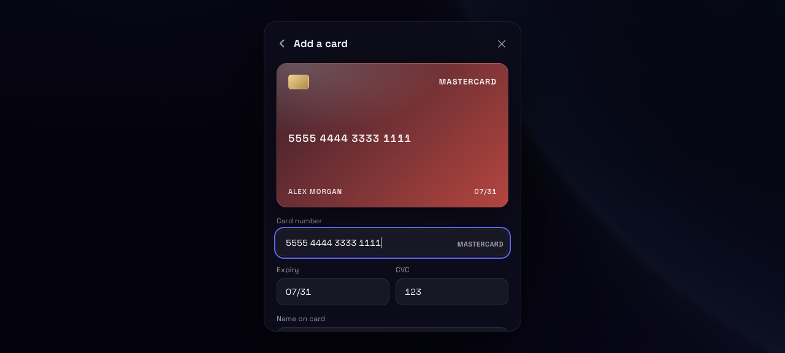

# fomo — onramp demo

A card-first onramp for a fictional trading app, showing where a Whop integration ends and
your own payment processor begins.

The bank and crypto rails are live, resolved from one API call. The cards sit beside them as
the rail you settle yourself.







---

## Run it

```bash
pnpm install
cp .env.example .env.local   # add your API key and company id
pnpm dev
```

Open <http://localhost:3000>. `npm` and `bun` work too.

```ini
# .env.local
WHOP_API_KEY=your_company_api_key
WHOP_COMPANY_ID=biz_xxxxxxxxxxxx
```

Grab a key from
**[whop.com/dashboard → Developer → Company API keys](https://whop.com/dashboard/developer)**,
and your company id from the dashboard URL. The key is read server-side only and never
reaches the browser.

---

## Integration

`POST /v1/deposits` returns every way an account can be funded without a credential:

- **Bank transfer** — wire instructions per settlement currency
- **Crypto** — a deposit address per network, with the tokens each one accepts

```ts
const API_BASE = "https://api.whop.com/api/v1";

export function createDeposit(account: string) {
	return request<Deposit>("/deposits", {
		method: "POST",
		body: JSON.stringify({ destination: account }),
	});
}
```

```bash
curl -X POST https://api.whop.com/api/v1/deposits \
  -H "Authorization: Bearer $WHOP_API_KEY" \
  -H "Api-Version-Date: 2026-07-27" \
  -H "Content-Type: application/json" \
  -d '{"destination": "biz_xxxxxxxxxxxx"}'
```

```json
{
  "object": "deposit",
  "account_id": "biz_xxxxxxxxxxxx",
  "hosted_url": "https://whop.com/deposit/your-company/",
  "methods": {
    "bank": {
      "currencies": [
        {
          "currency": "USD",
          "account_number": "000000000000",
          "routing_number": "021214891",
          "deposit_bank_name": "Cross River Bank",
          "deposit_bank_address": "885 Teaneck Road, Teaneck, NJ 07666 USA",
          "deposit_beneficiary_name": "Whop Inc - ACME LLC",
          "deposit_reference": "000000000000",
          "swift_bic": null,
          "rails": ["ach", "wire"]
        }
      ]
    },
    "crypto": [
      {
        "name": "Ethereum",
        "deposit_address": "0x0000000000000000000000000000000000000000",
        "icon_url": "https://whop.com/crypto/ethereum.svg",
        "supported_currencies": [
          { "name": "USDC", "icon_url": "https://whop.com/crypto/usdc.svg" }
        ]
      }
    ]
  },
  "metadata": {}
}
```

Every bank and crypto string is nullable in the contract, so the UI skips any row the API
leaves empty rather than printing `null`. Icon URLs come back with the response — the network
and token logos in the picker need no assets of your own.

Don't want to build a picker at all? `hosted_url` is a Whop-hosted deposit page for the same
account.

